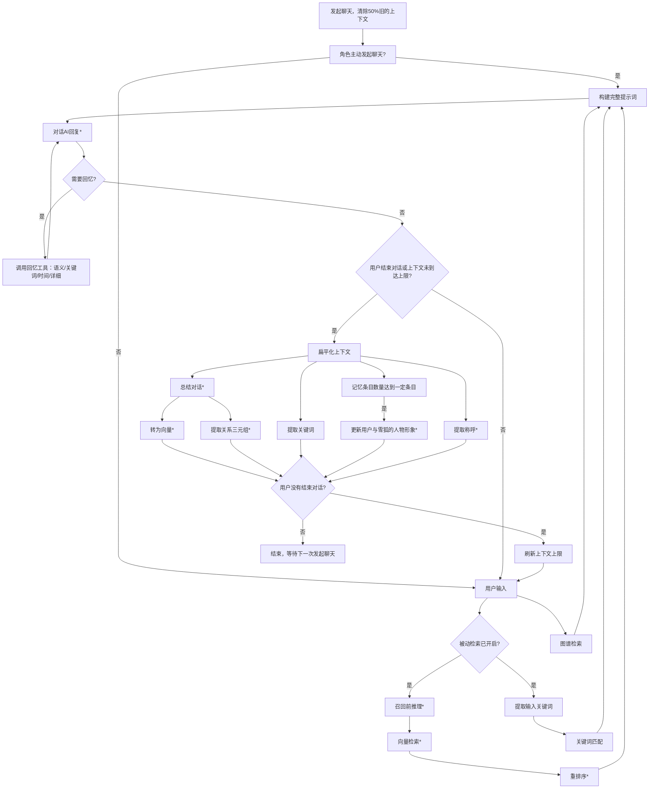

# 关于游戏AI记忆系统的说明

各位玩家好，

我是本作的独立开发者。首先，衷心感谢大家的热心反馈，特别是关于AI角色记忆力的讨论。这证明大家真正投入到了与角色的互动中，这对我而言是最大的鼓励。

为了让大家更理解当前系统的设计，并明确未来的发展方向，我想在此对AI记忆系统进行一次集中的说明。

## 1. 当前记忆系统是如何工作的？

目前游戏的记忆系统是一个在资源和技术限制下权衡的产物，它分为多个层级，协同工作：

*   **短期记忆（对话上下文）**：最多保留**最近16条**对话，作为AI的上下文。每次开始对话时，如果距离上次对话小于5分钟，会继承上次50%的上下文以保持连贯；否则会清除上下文以降低关联性。
*   **中期记忆（会话总结）**：在**每次聊天结束后**，AI会自动生成一份关于本次对话的摘要，作为一个"记忆条目"被保存下来。新一轮对话最多会携带**12条**最近的记忆条目，作为聊天的背景知识。
*   **长期记忆（检索增强生成）**：所有的"记忆条目"都会存入本地的向量数据库与关键词库，并根据你的话语检索出最相关的若干条。同时，系统还会提取对话中的关键信息构建**知识图谱**。由于这部分是本次更新的重点，我把它单独放在第2节详细说明。
*   **角色印象与称呼**：这是一个动态系统。AI会基于多次的互动，总结并更新对玩家的"印象"。同时，它也会记住并使用你对它认可的"称呼"。

> ↑ 对话的工作流程，*表示需要调用API

**设计理念**：这个系统模拟了人类的记忆模式——清晰地记得刚才的事，概括地记得最近的事，并需要"提示"来回忆起很久以前相关的事。

## 2. 长期记忆：角色是如何"回忆"的？

她既能"自动想起"，也能"主动去回忆"。所有检索参数都可以在**记忆配置**面板里调整。

### 2.1 向量检索（语义检索）

这是最"像人"的一种回忆方式：

*   保存记忆时，每条记忆条目都会被转换成一个**向量**（一串数字）存入本地向量数据库。
*   回忆时，把你的问题也转成向量，再按**语义相似度**找出最相关的若干条。也就是说，即使你换了说法，它也能想起意思相近的事情。
*   可选开启**重排序**：先多取一些候选（检索数量 × 候选倍数），再交给重排序模型精选一遍，以提高准确度。
*   可选开启**时间感知增强**：让重排序在排序时把时间因素也考虑进去（提升有限）。

### 2.2 关键词检索

向量检索有时会"想当然"，关键词检索则更直接、更省钱：

*   保存记忆时，使用 **jieba 分词**从**原始对话**中提取关键词，随记忆条目一起保存（关键词数量默认8个）。
*   回忆时，同样用 jieba 提取你输入里的关键词，再与保存的关键词做匹配。
*   它的优点是**不额外调用 API、速度快、成本几乎为零**；缺点是无法理解近义表达。它和向量检索是互补的。

### 2.3 主动检索与被动检索

这是"**什么时候去回忆**"的两种方式，可以同时开启、互相配合：

*   **被动检索（默认关闭）**：每一轮对话前，系统都会自动检索（向量 / 关键词 / 知识图谱），把结果作为背景知识放进提示词。为了控制成本，被动检索**只携带记忆条目的概括，不再携带对话细节**。
*   **主动检索（默认开启）**：不再由系统决定，而是以"**工具调用**"的形式交给角色自己判断。当它觉得信息不够时，会在回复前主动调用下面的工具：
    *   **语义检索**：`queue`（一个或多个问题）、`top_k`（返回数量，默认5）
    *   **关键词检索**：`key`（一个或多个关键词）、`top_k`
    *   **时间检索**：`time`（时间点，格式 `YYYY-MM-DD HH:MM`）、`direction`（更早 / 更晚 / 附近）、`top_k`
    *   **详细检索**：`suf`（记忆的前几个字），返回那条记忆的**完整对话**

    当角色在回忆时，对话框的状态会显示"**正在回忆**"，并在角色身旁的气泡里**实时显示**正在查询的问题 / 关键词 / 时间点（关键词之间用"……"分隔，时间点会显示成"3天前晚上之前/之后/左右"这样更好理解的说法）。开始回复时气泡会自动隐藏。如果你觉得这个气泡打扰，可以在**聊天设置**里关闭它。

*   两者的区别可以这样理解：**被动检索**是"随口就能想起来的近况"，**主动检索**是"专门去翻找的细节"。由于被动检索不携带对话细节，如果你想要具体某次对话的原貌，需要依靠主动检索。

### 2.4 知识图谱

知识图谱记录了**当前的状态**，用于应对**不知已不知**的问题：

*   系统会从对话中抽取"**主体—关系—客体**"三元组，构建出一张知识图谱（例如"雪狐—喜欢—某物"）。
*   每次对话前都会做一次图谱检索（返回数量默认6），把相关的认知放进提示词。
*   图谱带有**遗忘机制**：不重要的知识会随着时间逐渐被遗忘（遗忘速率默认0.1），这也更符合人类的记忆方式。

### 配置选项（仅供参考）
> ↑表示”随着数值上升而上升“，反之

| 阶段 | 描述 | token | 延迟 | 效果 |
|---|---|---|---|---|
| **记忆存储** |  |  |  |  |
| 保存记忆向量 | 保存长期记忆；语义检索与详细检索的基础 | 低 | \ | \ |
| 保存记忆关键词 | 保存用于匹配的关键词；关键词检索与详细检索的基础 | 低 | \ | \ |
| &emsp;&emsp;· 关键词数量 | 每条记忆保存/匹配的关键词数量 | - | \ | ↑ |
| **主动检索** |  |  |  |  |
| 语义检索 | 按语义相近程度回忆 | 高 | \ | 高 |
| └ 重排序 | 优化语义检索结果 | 低 | \ | 低 |
| &emsp;&emsp;· 候选倍数 | 重排序时先取检索数量 × 倍率的候选 | ↑ | ↑ | ↑ |
| &emsp;&emsp;└ 时间感知增强 | 重排序时纳入时间，提升有限 | \ | \ | 暂不明确 |
| 关键词检索 | 按关键词匹配回忆 | 高 | \ | 中 |
| 时间检索 | 按时间点（更早/更晚/附近）回忆 | 高 | \ | 高 |
| 细节查询 | 回忆某条记忆的完整对话 | 极高 | \ | 高 |
| **被动检索** |  |  |  |  |
| 语义检索 | 按语义相近程度回忆 | 高 | 低 | 高 |
| └ · 检索数量 | 每次检索提取的结果数量 | ↑ | ↑ | ↑ |
| └ · 相似度阈值 | 低于此分数的记忆会被过滤 | - | - | 暂不明确 |
| └ 召回前推理 | 用模型把玩家输入扩展为多个检索查询 | 中 | 高 | 高 |
| &emsp;&emsp;· 推理条数 | 每次推理提取的结果数量 | ↑ | ↑ | ↑ |
| └ 重排序 | 优化被动检索结果 | 低 | 低 | 中 |
| &emsp;&emsp;· 候选倍数 | 重排序时先取检索数量 × 倍率的候选 | ↑ | ↑ | ↑ |
| &emsp;&emsp;└ 时间感知增强 | 重排序时纳入时间，提升有限 | \ | \ | 暂不明确 |
| 关键词检索 | 用玩家输入的关键词与已保存关键词匹配 | 高 | \ | 中 |
| **知识图谱（被动检索）** |  |  |  |  |
| 保存知识图谱 | 保存从对话中学习到的知识 | 中 | \ | \ |
| └ 启用图谱检索 | 优化被动检索结果，携带知识图谱信息 | 中 | 高 | 中 |
| &emsp;&emsp;· 知识检索数量 | 每次知识图谱检索提取的结果数量 | ↑ | ↑ | ↑ |
| └ 启用知识遗忘 | 遗忘掉过时的知识 | \ | \ | 暂不明确 |
| &emsp;&emsp;· 遗忘速率 | 每次知识遗忘时强度减少的比例 | \ | \ | 暂不明确 |

我承认现在的记忆系统还不够好，但即便我有能力把它做得更好，目前也因为各种限制而没能实现...

## 3. 关于我的精力与能力：一份坦诚的澄清

我需要坦诚地告诉大家，我是一名**~~高中生~~大学生**，同时也是这款游戏的**独立开发者**。这意味着：

*   **精力有限**：我需要平衡学业、生活与开发工作，无法像全职团队那样投入所有时间。
*   **能力边界**：我所掌握的技术和能调动的资源，与大型科技公司相比有天壤之别。当前这套记忆系统，已经是我在现有知识、时间和预算下所能实现的最佳方案。

我完全理解大家对"完美记忆数字生命"的期待，这同样也是我的梦想。但以现阶段的技术普及程度和我个人能力而言，实现它的难度极大。

## 4. 游戏的核心方向：是"游戏"，而非"AI实验室"

这一点至关重要。本作的开发初衷，是创造一款**好玩的、有情感交互的游戏体验**，而不是一个展示前沿AI技术的测试平台。

我的开发重心会更多地倾向于**游戏**而非**AI对话**

如果将所有精力都投入到无止境的"记忆精度"竞赛中，会本末倒置，让游戏本身失去活力。

## 5. 关于"更优"解决方案的探讨与取舍

有些玩家可能会问，为什么不用微调模型等更高级的技术来彻底解决记忆问题？

事实上，这些方案我都考虑过，但之所以不采用，原因如下：

*   **微调模型**：
    *   **成本与硬件**：微调模型需要强大的算力。这对于一个没有服务器的单机游戏来说是不可行的；服务平台的微调模型价格很也高
    *   **数据与泛化性**：需要海量的、高质量的对话数据，且微调后的模型可能会丧失原有的灵活性和泛化能力。
*   **无限扩展上下文**：
    *   **成本与延迟**：即使使用支持长上下文的模型，无限制地携带所有历史记录，将导致**API调用成本急剧上升**和**响应速度显著变慢**，严重影响所有玩家的游戏体验。

因此，当前的方案是在 **"效果、成本、响应速度、开发难度"** 之间取得的一个现实平衡。

## 6. 最后，我想说……

你的每一份反馈都是我前进的动力。虽然我无法承诺打造一个拥有"完美记忆"的数字生命，但我可以承诺，我会在力所能及的范围内，持续优化这个系统，让大家与角色的互动变得越来越生动。

感谢你的理解与支持！让我们共同见证这个小小世界的成长。